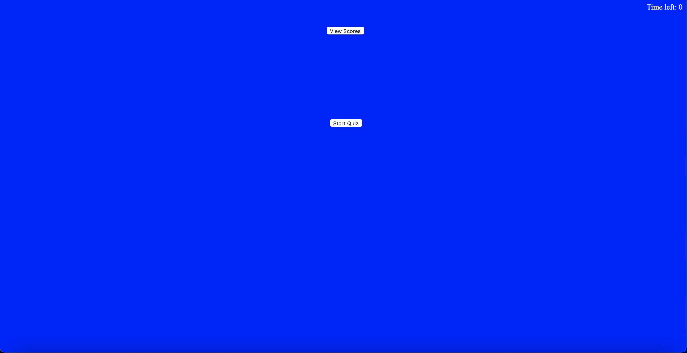
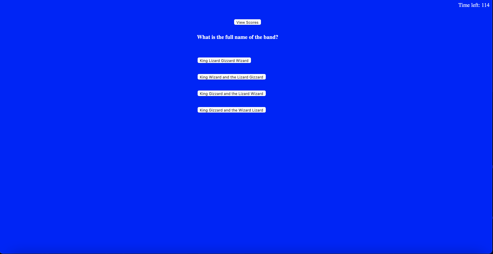
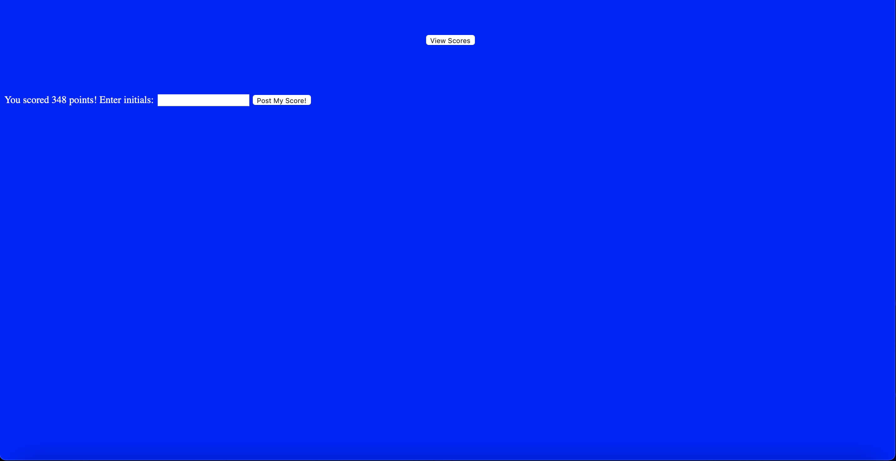
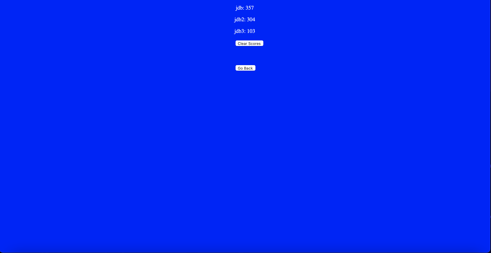

# timed-quiz-js

For this project we were tasked with creating a shot quiz using javascript. I chose to do my quiz based around the band King Gizzard And The Lizard Wizard. After each time we took the quiz we had to save our score into our local storage in the browser to access it on a high scores page, also with a clear scores button.

REPOSITORY PAGE:
https://github.com/slimeforest/timed-quiz-js

LIVE PAGE:
https://slimeforest.github.io/timed-quiz-js/

